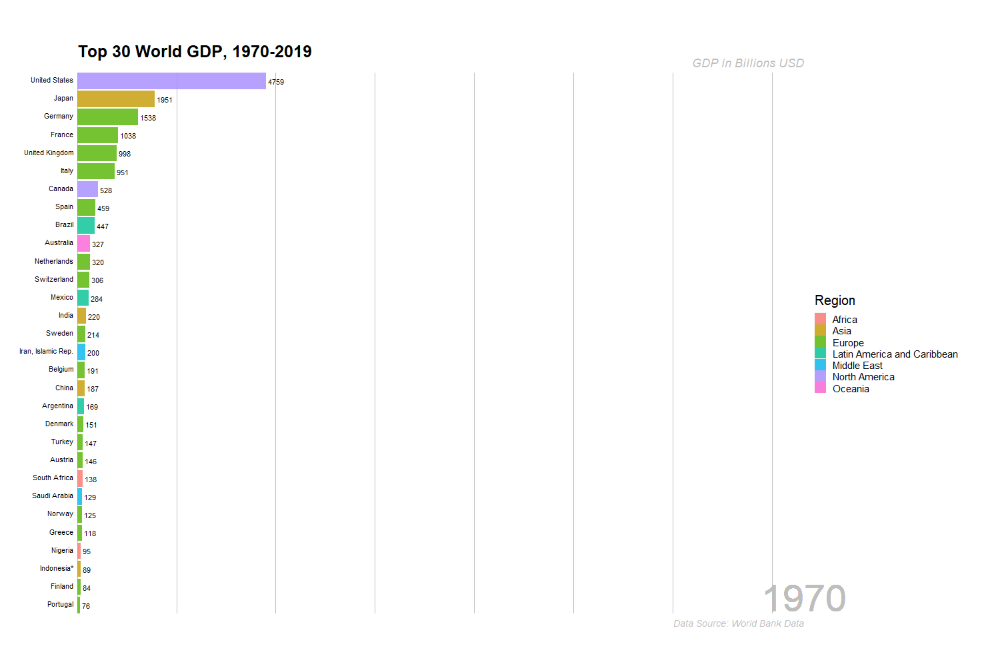

# Creating-animated-bar-chart-in-R

- What: Animated bar chart in R
- How: Using `ggplot2` and `gganimate` 

**Acknowledgment:** 
This project uses the modified code from several sources:
- [Towardsdatascience - create animated bar charts using r](https://towardsdatascience.com/create-animated-bar-charts-using-r-31d09e5841da)
- [R bloggers - how to create a bar chart race in r](https://www.r-bloggers.com/2019/04/how-to-create-a-bar-chart-race-in-r-mapping-united-states-city-population-1790-2010/)

### Final Output (GIF):

### Data Source:

This project uses GDP database downloaded from [databank.worldbank.org](https://databank.worldbank.org/data/reports.aspx?source=2&series=NY.GDP.MKTP.CD&country=#)
